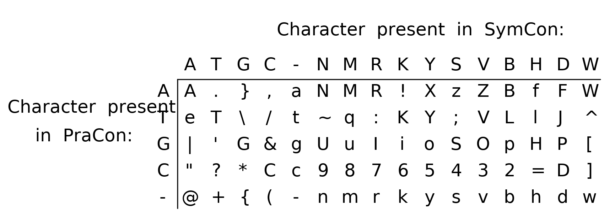

# RepeatedAcquisitionOfEndosymbiontsInFeatherLice

Overview: 
These scripts were used in a study to annotate the gene inventories of feather louse endosymbionts following alignment of their sequence reads to a whole genome sequence obtained from a close free living relative, _S. praecaptivus_. Comparative analyses then facilitated the identification of intact genes within the symbiont genomes using an Expectation Maximization (E-M) algorithm. Contingencies underpinning gene losses among the symbionts were then detected and validated using the Proximus algorithm. Additional scripts facilitate visualization of resulting data. 
 
Dependencies: 
• Processing 
• R with packages mixtools, cba and scales 
 
Usage: 
 
Identification of intact genes: 
Sequence reads from query organisms (feather louse endosymbionts in our study) were mapped to the whole genome sequence of a reference organism (S. praecaptivus in our study) and visualized in Geneious v8.1.8. The consensus sequence, reference sequence and annotation table were exported and then processed by the LAnner pipeline, comprising seven scripts. All scripts require a namelist.csv file (located in exampleFiles in this repository) to facilitate batch processing. This namelist.csv file and any associated input files should be located in a sharedResources directory alongside directories containing the individual processing scripts. Note that filenames are typically appended with identifiers (\*-). For example Cocln-SymCon.txt represents data from the endosymbiont of _Columbicola claytoni_ (see namelist.csv for complete list). 
• LAnner_1_ComConGenerator - Takes the consensus sequence of a given organism (file name = \*-SymCon.txt, located in exampleFiles in this repository) aligned to the reference sequence (file name = \*-PraCon.txt located in exampleFiles in this repository) that is gapped in accordance with the alignment. The script then outputs a sequence file encoded to display the contents of both input files (file name = \*-ComCon.txt) in accordance with the following key: 

• LAnner_2_AnnTabReformatter - Takes the exported annotation table (file name = \*-AnnTab.csv, located in exampleFiles in this repository.). Exports a reformatted version of the annotation table (file name = \*-AnnTabFin.csv, located in exampleFiles in this repository) that has non-delimiting commas removed and a simplified header. 
• LAnner_3_snLED - Takes the combined sequence file (\*-ComCon.txt), and the reformatted annotation table (\*-AnnTabFin.csv). Calculates all open reading frames (ORFs) with either canonical or alternative bacterial start codons within ± 25 bp of the ortholog in the reference genome. The script then determines the ORF with the lowest Levenshtein edit distance (LED) from the reference ortholog for each gene. Exports a modified annotation table (ZFin-\*-AnnTabFin.csv) that additionally includes the LED, a size normalized LED (snLED), and both the predicted nucleotide and protein sequences of the ORF with the lowest LED, for each gene. 
• LAnner_4_R_Write - Takes the modified annotation tables (ZFin-\*-AnnTabFin.csv). Exports R code to preform expectation-maximization analysis. Produces LAnner_5_ExpectationMaximization.  
• LAnner_5_ExpectationMaximization - Preforms expectation-maximization (E-M) analysis on the snLEDs. Exports a table (EMdata.csv) containing the results of the E-M analysis. 
• LAnner_6_R_Read - Takes the EMdata.csv table and appends the entries in the namelist table with snLED values estimated by E-M analysis to represent cutoffs for intact genes. 
• LAnner_7_Predictor - Takes the modified annotation tables (ZFin-\*-AnnTabFin.csv) and appends all entries with predictions of gene status (0 = missing gene, 0.5 = pseudogene, 1 = intact gene) based on the cutoffs represented in namelist.csv. 
 
Contingency Analysis: 
Data derived from LAnner_7_Predictor (ZFin-\*-AnnTabFin.csv), maintaining the E-M-derived predictions for all genes is subject to comparative analysis to identify patterns of gene inactivation or loss that are contingent in nature. Two approaches were employed for this objective: The first focuses on analysis of Hamming distances derived from binary strings encoding predictions of functional status among individual genes. The second utilizes the Proximus algorithm in the R package ‘cba’, which identifies patterns of contingency. Some of these scripts require a file, namelist2.txt, to be present in a sharedResources directory alongside directories containing the individual processing scripts. 
• Contingency_1_StringMaker - Takes annotation tables (ZFin-\*-AnnTabFin.csv) that have been processed by LAnner_7_Predictor. Exports a file (Strings.csv) that contains binary strings for those genes that are maintained in an intact form in only a subset of samples. The output of this script is utilized in both the Hamming distance and Proximus-based approaches.  
• Contingency_2_ShannonAdder - Takes the binary strings (Strings.csv) and computes Shannon entropies for each string. Exports a file (Shannon.csv) that maintains the content of Strings.csv and is appended to include Shannon entropy values. 
• Contingency_3_HammingString - Takes the binary strings (Strings.csv) and computes Hamming distances between all pairwise combinations of strings. Exports a file (HammingDistance.csv) that tabulates the Hamming distance values between the binary strings. 
• Contingency_4_prepDataForR - Takes the binary strings (Strings.csv). Exports a file (rdat_I.csv) to the sketch directory maintaining the same information presented in a format that facilitates Proximus analysis in R. 
• Contingency_5_proximusAnalysis - akes the binary strings (rdat_I.csv) and performs analysis using the Proximus algorithm. Exports a file (dataFromR2.txt) to the directory of the “Contingency_6_nameAndFilter” sketch (see below) that contains the results of the analysis.  
• Contingency_6_nameAndFilter - Takes the results of the Proximus analysis (dataFromR2.txt), and a file (tagsAndNams.csv) that lists the locus tags and names of genes and exports three output files. The first (removal Flag.csv) is the entire results with separated sets that are listed by tag exclusively, and has a column “remove” indicating sets that are subsets of other sets and are eliminated in the other two files. The second file (proximusResults_tagsOnly.csv) contains the same information without sets that are subsets of other sets or a removal flag column. The third file (proximusResults.csv) lists the same information as the second with gene names utilized instead of locus tags with the caveat that some genes have not been assigned proper names and can therefore only be identified by locus tags. 
 
Visualization: 
• G_Render - Takes the annotation tables (ZFin-\*-AnnTabFin.csv) that have been processed by LAnner_7_Predictor and a color map (Gradient.txt). Renders output files depicting gene status (with intact genes in green, pseudo genes in purple and missing genes in black) across all query genomes, including summary information. One output file (GRender.tif) uses sub-pixel rendering while another (GRender_1px.tif) renders at a scale of one pixel per gene. 
• G_Viewer - Takes specialized output files from G_Render saved within its sketch directory (tab.tif and geneRender.tif) and a table of gene annotations (Tags.csv). Serves as an interactive data visualization tool that facilitates manual inspection of the whole dataset and includes scrolling and selection functions. 
• C_Map - Takes the Shannon entropies (Shannon.csv), Hamming distances (HammingDistance.csv), a file containing labeling instructions (labels.txt), and two color maps\* (linear_ternary-blue_0-44_c57_n256.csv and linear_ternary-red_0-50_c52_n256.csv). Renders a circular figure (out_C_BinaryColMap_NT.tif) with bezier curves depicting the strength of contingent relationships between all genes in the dataset. To improve clarity in visualization, genes whose binary strings have Shannon entropies less than 0.43 are excluded.  
\*Color maps used for rendering the relationships are from CET Perceptually Uniform Colour Maps (https://colorcet.com/index.html) by Peter Kovesi (See also Good Colour Maps: How to Design Them 2015) and are under a Creative Commons BY License (https://creativecommons.org/licenses/by/4.0/). 
• C_Map_panel1 - Takes the Shannon entropies (Shannon.csv), binary strings (included in the same file as the Shannon entropies) and Hamming distances (HammingDistance.csv).  Produces a file (PanelA.tif) depicting a matrix of selected genes, color coded in accordance with predicted functional status. This particular script focuses on genes encoding respiratory chain components, but could be modified to focus on other targets. Also displays Hamming distances, Shannon entropies, and estimates of relationship strength between binary strings. 
• C_Map_panel2 - Takes the Shannon entropies (Shannon.csv). Produces a plot (PanelB.tif) depicting the frequencies of strings in accordance with string (Shannon) entropy. 
• Three_D_Hist - Takes annotation tables (ZFin-\*-AnnTabFin.csv) output by LAnner_7_Predictor, and a color map (Gradient.txt). Produces a three dimensional histogram showing the numbers of genes in accordance with snLED values. Histogram bars are colored in accordance with the predicted functional status of genes (green = intact, purple = non-intact) derived from the E-M analysis.  
